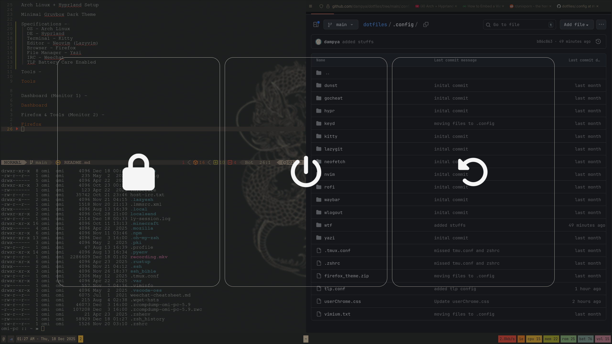

Arch Linux + Hyprland Setup

Minimal Gruvbox Dark Theme

Specifications -

1) OS - Arch Linux
2) DE - Hyprland
3) Terminal - Kitty
4) Editor - Neovim (Lazyvim)
5) Browser - Firefox
6) File Manager - Yazi
7) IRC - Weechat
8) Keybinds - Keyd
9) App Launcher - Rofi
10) TLP Battery Care Enabled
11) Font - Nerd Font Mono

Tools -
<video width="100%" controls>
  <source src="media/recording.mp4" type="video/mp4">
</video>

Dashboard (Monitor 1) -

Firefox & Tools (Monitor 2) -

Logout - 

