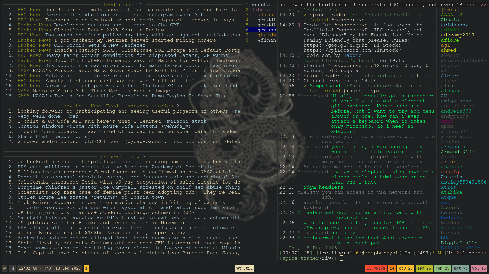

Arch Linux + Hyprland Setup

Minimal Gruvbox Dark Theme

Specifications -
OS - Arch Linux
DE - Hyprland
Terminal - Kitty
Editor - Neovim (Lazyvim)
Browser - Firefox
File Manager - Yazi
IRC - Weechat
Keybinds - Keyd
App Launcher - Rofi
TLP Battery Care Enabled

Tools -

Dashboard (Monitor 1) -

Firefox & Tools (Monitor 2) -

Logout - 

!(Logout)[./media/logout.png]
